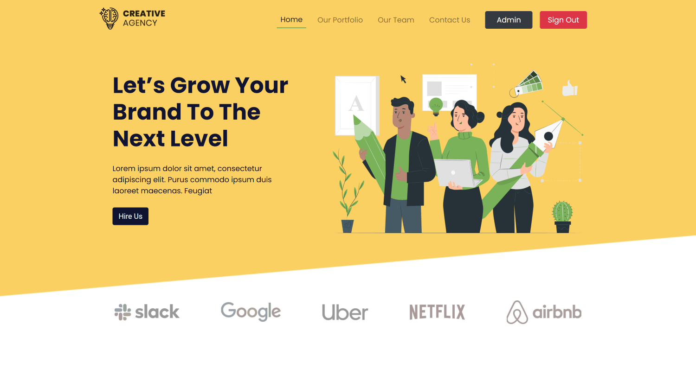
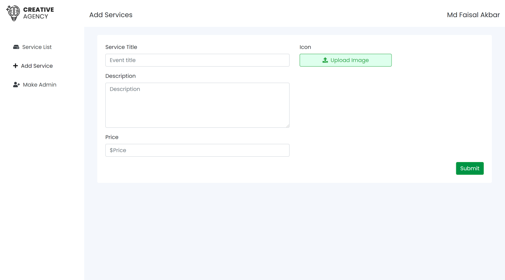
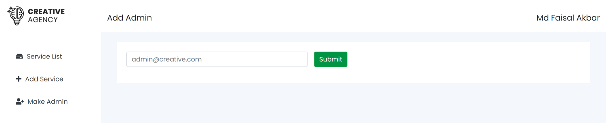
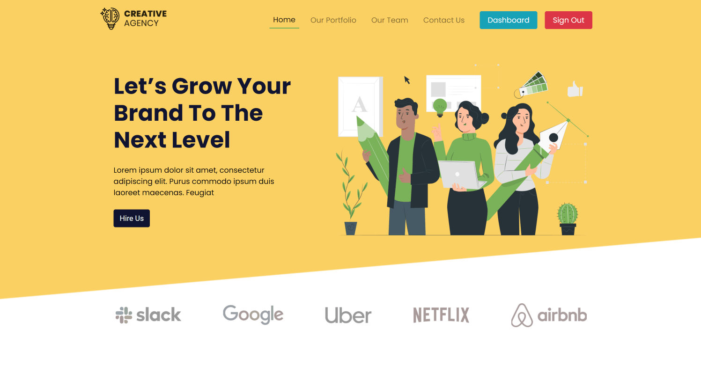
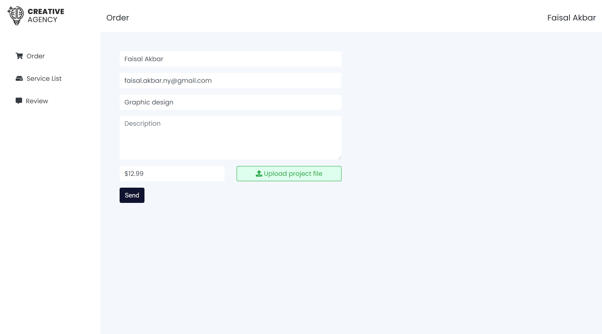
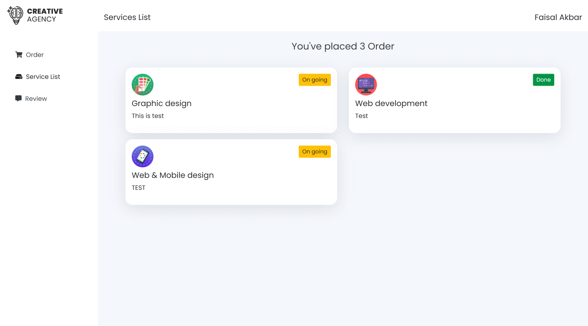
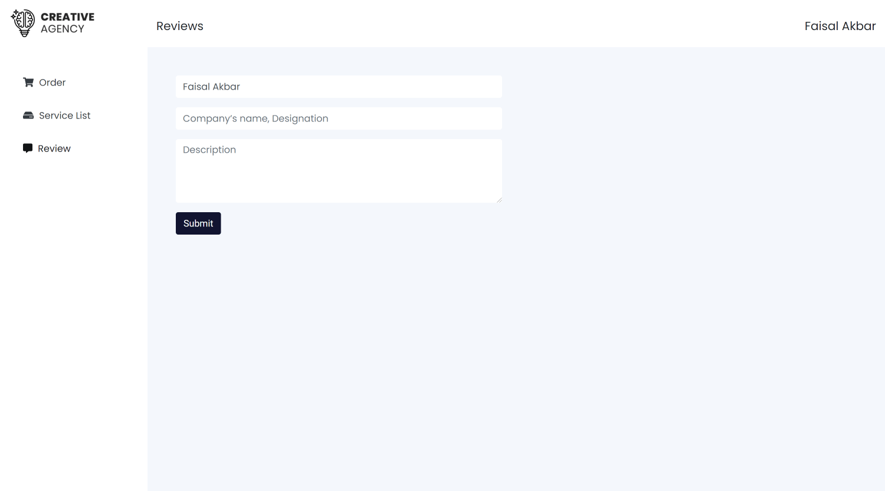

# Creative Agency

A responsive IT Service Seller web application.

[Live Website](https://creative-agency-ea3df.firebaseapp.com/) | [Live API Server](https://creative-agency-react.herokuapp.com)

## Feature

- Responsive MERN Stack project with firebase authentication, admin authentication, persistent login and dashboard functionality for customer and admin
- Customer have ability to register in available services, check status of service(s) registered, and provide feedback
- Only admin can update the customer service status from pending to on going to done, add new service with image and add new admin.
- Customer need to click on service image card to register in specific service.
- Sign in is required to register in any service or to view Customer dashboard with services status.
- Logged in user will see a button named "Dashboard", where they can view the services they registered.
- If Admin is logged in, admin will see a button named "Admin".

Note: Only admin user have ability to view admin dashboard.

## Front-end Technology

- React JS
- Firebase Authentication (Google)
- React Router, Private Router
- React Hook Form
- React Context API
- React Hook
- Firebase Hosting
- Session Storage
- React Spinners
- React Spring
- React Alice Carousel
- Bootstrap
- CSS3
- FontAwesome
- Faker Api

## Back-end Technology

- Node JS
- Express JS
- Express file upload
- Mongodb
- Heroku
- Cors
- Body parser
- Dotenv
- nodemon

[Back-end Repository](https://github.com/faisalcep/creative-agency-server)

---

## Key Feature Screenshots

> Admin- Landing Page

> Admin Dashboard- Service List

> Admin Dashboard- Add Service

> Admin Dashboard- Make Admin

> Logged In User Landing Page

> Logged In User Dashboard- Order

> Logged In User Dashboard- Service List

> Logged In User Dashboard- Review

---

## License

MIT License

Copyright (c) [2020] [Faisal Akbar]

Permission is hereby granted, free of charge, to any person obtaining a copy
of this software and associated documentation files (the "Software"), to deal
in the Software without restriction, including without limitation the rights
to use, copy, modify, merge, publish, distribute, sublicense, and/or sell
copies of the Software, and to permit persons to whom the Software is
furnished to do so, subject to the following conditions:

The above copyright notice and this permission notice shall be included in all
copies or substantial portions of the Software.

THE SOFTWARE IS PROVIDED "AS IS", WITHOUT WARRANTY OF ANY KIND, EXPRESS OR
IMPLIED, INCLUDING BUT NOT LIMITED TO THE WARRANTIES OF MERCHANTABILITY,
FITNESS FOR A PARTICULAR PURPOSE AND NONINFRINGEMENT. IN NO EVENT SHALL THE
AUTHORS OR COPYRIGHT HOLDERS BE LIABLE FOR ANY CLAIM, DAMAGES OR OTHER
LIABILITY, WHETHER IN AN ACTION OF CONTRACT, TORT OR OTHERWISE, ARISING FROM,
OUT OF OR IN CONNECTION WITH THE SOFTWARE OR THE USE OR OTHER DEALINGS IN THE
SOFTWARE.
